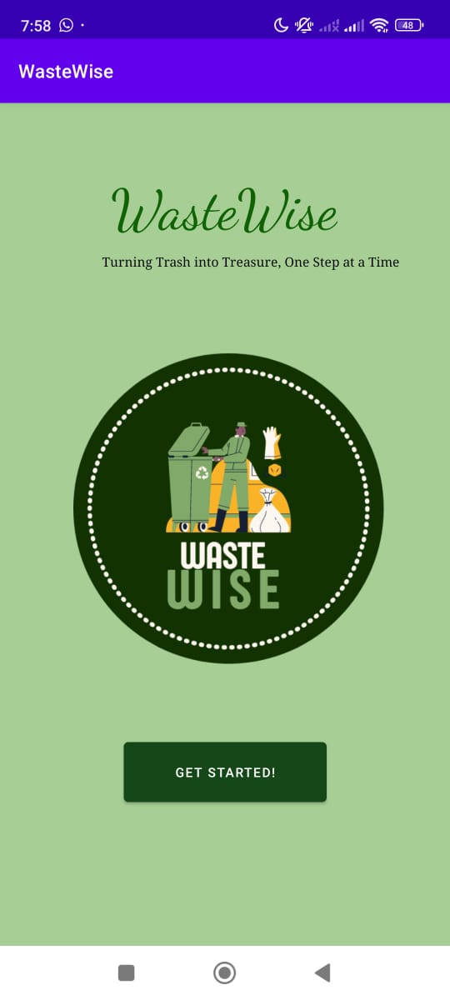
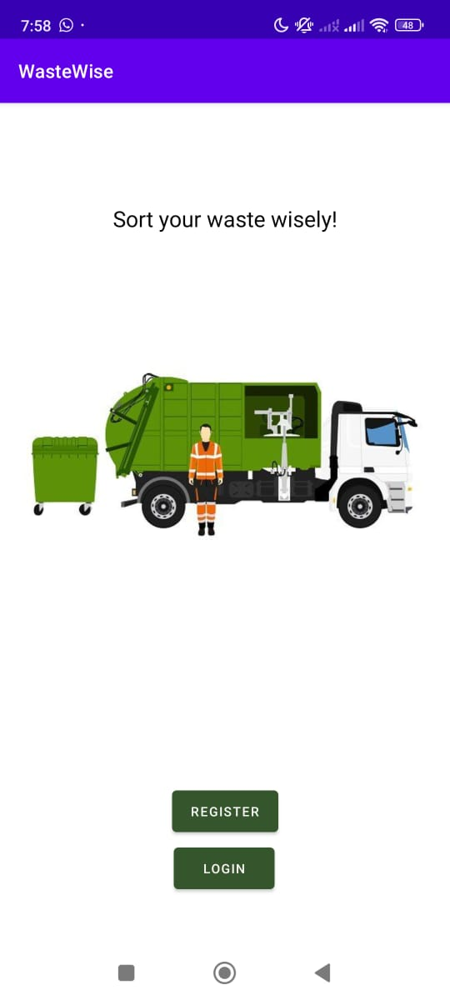
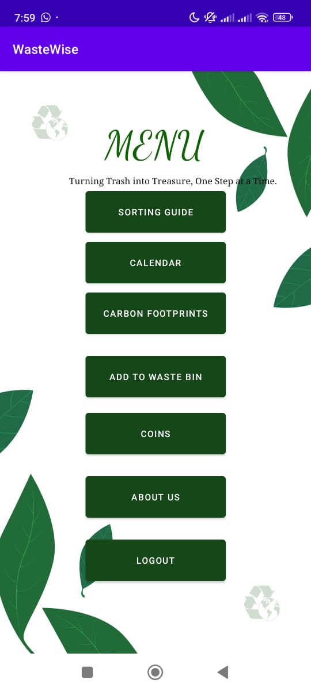
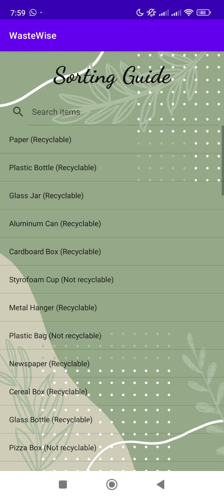
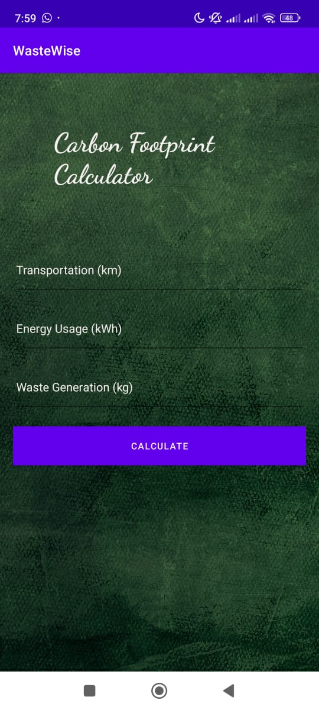
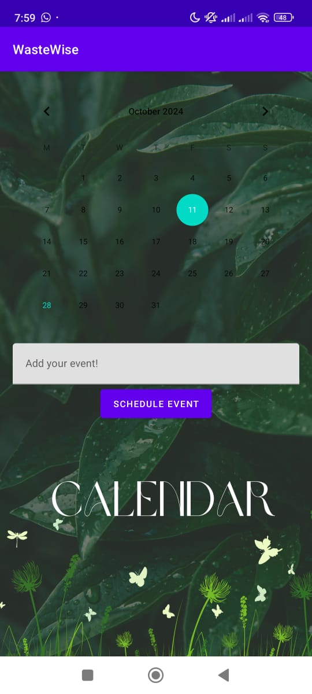

# WasteWise - AI Powered Waste Classification Application 

WasteWise is a waste classification and sorting system that helps users identify recyclable and non-recyclable materials using machine learning. It also includes features like carbon footprint calculation and an educational guide on proper waste disposal. This project was designed to promote environmental awareness and simplify the recycling process.

The machine learning model powering WasteWise is capable of classifying waste with an accuracy of 93%. The system provides additional features such as a carbon footprint tracker and a material sorting guide, available through both a web app and an advanced mobile app.

### Waste Classification:
**Real-time Waste Detection:** Uses a machine learning model to detect and classify waste into recyclable and non-recyclable categories.
**93% Model Accuracy:** The ML model used in WasteWise has a classification accuracy of 93%.
### Carbon Footprint Calculator:
Users can track their daily carbon footprint based on waste habits, energy use, and transport, with tips on how to reduce their environmental impact.
### Material Sorting Guide:
**List of Recyclable Materials:** Provides a comprehensive list of items that can be recycled.
**List of Non-Recyclable Materials:** Offers information on what cannot be recycled and how to dispose of it safely.
### User-friendly Interface:
An easy-to-navigate design with intuitive features to help users classify waste and track their carbon footprint.

The datasets used can be found here -
1.  https://www.kaggle.com/datasets/techsash/waste-classification-data 
2. https://www.kaggle.com/datasets/alistairking/recyclable-and-household-waste-classification 

### Machine Learning Model
The waste classification model was trained using TensorFlow and Keras, achieving:

Accuracy: 93%
**Classes:** Recyclable vs Non-Recyclable
**Dataset:** The model was trained on a diverse dataset containing thousands of labeled images of waste items.
The ML model processes input images from the camera and classifies them in real-time.

### Technologies Used
**Languages:** Kotlin, Java
**UI/UX:** XML for layout and design
**Machine Learning:** TensorFlow, Keras
**Backend Services:** Firebase for user data and authentication
**Networking:** Retrofit and OkHttp for API requests
**Database:** Firebase Realtime Database for storing user activity and carbon footprint data
**Authentication:** Firebase Authentication for user login and data security

## Project Screenshots

Here are some screenshots showcasing the Sign Hope application in action:

    
    
    

    
    
    

